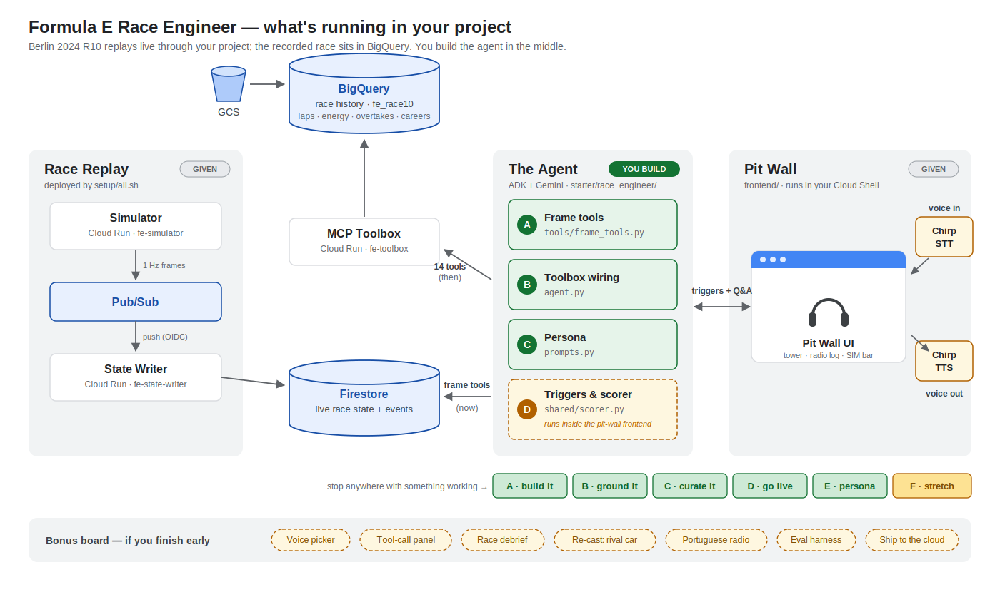

<!-- TINYURL: https://tinyurl.com/FE-Hack-2 -->

# Build a Formula E Race Engineer

---

## STEP 0 — do this FIRST, before the instructor starts talking

> **WHERE:** your lab project's Google Cloud console → Cloud Shell (the `>_`
> icon, top right) → Open Terminal. Authorize if prompted.
> **WHAT — paste all four lines:**
> ```bash
> git clone https://github.com/haggman/formula-e-race-engineer.git
> cd formula-e-race-engineer
> source activate.sh
> bash setup/all.sh
> ```

That last command deploys your personal race-data plane (~10 minutes,
budget 20). **Don't watch it.** Open a second Cloud Shell tab (the `+`)
and get your editor ready instead:

> ```bash
> cd formula-e-race-engineer
> cloudshell workspace .        # opens the Cloud Shell Editor in the repo
> ```

⏸ **STOP HERE. Eyes up front — the instructor takes it from here.**
When they send you back to this guide, pick up at **Welcome back** below.

---

## Welcome back

You just watched the finished product: an AI race engineer that watches a
live Formula E race, decides for itself when something deserves a radio
call, answers questions by reaching into live telemetry *and* race
history, and speaks over team radio. Today you build its brain.

The race is real: Berlin 2024, Round 10. The driver is real: car #13,
António Félix da Costa, who started P10 and won. The data is real: every
lap, every overtake, every attack-mode activation, 1.28 million telemetry
samples. The race replays through your project at up to 5× speed, and
your agent rides along.

First, confirm your Step-0 setup finished:

> **WHERE:** Cloud Shell, repo root (`cd ~/formula-e-race-engineer` if needed)
> **WHAT:**
> ```bash
> source activate.sh        # every new tab needs this — it's always the fix
> bash setup/verify.sh      # five checks; you want the GREEN LIGHT
> ```

If a check is ✗, it names the setup script to rerun. Indexes "still
building" just means wait a few minutes and re-verify.

## The map



Read it left to right. The **Race Replay** column and the **Pit Wall**
column are GIVEN — deployed plumbing and a finished UI. The **Agent**
column is YOURS: four build surfaces, Tier A through Tier D.

| Piece | Where | What it does |
|---|---|---|
| Simulator | Cloud Run (`fe-simulator`) | Replays the race, publishing 1 Hz frames to Pub/Sub |
| State Writer | Cloud Run (`fe-state-writer`) | Pub/Sub → Firestore: the live "now" |
| Firestore | GCP | Current race state + event stream |
| BigQuery | GCP (`fe_race10`) | The recorded race + 10 seasons of career history |
| MCP Toolbox | Cloud Run (`fe-toolbox`) | 14 BigQuery tools your agent will call |
| Pit-wall frontend | **your Cloud Shell** | The UI, voice loop, and trigger system — given |
| `starter/race_engineer/` | your editor | **You work HERE** — a partially built agent with marked TODOs |
| `solution/race_engineer/` | your editor | The answer key: same layout, file for file. Stuck? Open the same filename and read. You learn more from shipping than from suffering. |

Your code runs in Cloud Shell on purpose: the part you iterate on has a
seconds-long edit loop. Change a prompt, restart, hear the difference.
The `AGENT_PACKAGE` env var selects which package the system runs (your
shell defaults to `starter.race_engineer`); every test tool prints which
package it loaded — check the banner if results confuse you.

**Names, two registers:** the pit wall displays driver SURNAMES (Da Costa,
Cassidy, Wehrlein), but the data — tool responses, BigQuery tables, test
output — speaks 3-letter codes (DAC, CAS, WEH). You'll see both;
they're the same people. `get_field_am_status` is the agent's code→car
directory.

**Before you write any code:** read [`HOW_IT_WORKS.md`](HOW_IT_WORKS.md)
— ten minutes on what a *frame* is, why there are two data worlds, what
makes the engineer decide to talk, and which files are yours versus
plumbing. It will save you an hour of reverse-engineering.

## Two minutes of Formula E

**The race:** Berlin E-Prix 2024 Round 10. 41 laps, ~48 minutes. Da Costa
(DAC, car 13, TAG Heuer Porsche) starts P10, carves to P3 by lap 5, and
wins. His main fights: Cassidy (CAS) — 11 position exchanges, the real
battle for the win — and Vergne (JEV), his grid neighbor. Two retirements
punctuate the story: Günther (car 7) on lap 10 and Fenestraz (car 23) on
lap 24.

**Attack Mode**, the strategic heart of Formula E:

- A fixed power boost (300 kW → 350 kW), earned by driving through an
  activation zone placed OFF the racing line (at Berlin: Turn 2) — taking
  it costs track position. When it's active, the car's halo glows
  magenta; everyone can see it.
- Every driver must use exactly TWO activations per race. The total boost
  time is 240 seconds, split per a pre-armed "scenario": 1 = 60s+180s,
  2 = 120s+120s, 3 = 180s+60s.
- An ARMING is declared intent (which scenario); an ACTIVATION is the
  actual deployment. Drivers re-arm as strategy evolves — DAC armed 9
  times this race, most in the field.
- Once activated it runs its full duration. No early exit. The clock
  burns even under safety car. This is why it's worth an AI engineer:
  fixed-duration power committed against an unknown future.
- On lap 3 of this race, about half the field activates within seconds —
  watch your position tower light up orange. DAC deliberately holds back.
- The move of this race, laps 7–9: DAC deliberately hands back the lead
  to take his short 60s activation, drops to P3, and repasses with the
  boost still lit — a planned sacrifice. An engineer that calls it as it
  happens earns its seat.

**Energy:** every car finishes with exactly 100% of its budget consumed
(the data is normalized), so what matters is mid-race deltas versus the
field average — is DAC spending faster or slower than rivals right now?

## The two worlds (the architecture in one idea)

Every question your engineer answers draws on one or both of:

| World | Store | Latency | Example |
|---|---|---|---|
| **Now** | Firestore, via your frame tools | instant | "Who's behind us?" |
| **Then** | BigQuery, via MCP Toolbox | seconds | "What was our fastest lap?" |

The agent decides which world a question needs. The best questions span
both without the asker saying so — "how's our energy versus Cassidy?"
needs current state AND consumption history, fused. That orchestration is
what you're building, and it's the whole reason this hackathon exists.

One rule that makes the demo honest: the agent is *time-honest*. History
tools only return events up to the replay's current moment. Ask about lap
20 while the race is on lap 8 and your engineer doesn't know yet.

## Gemini Code Assist is sitting right there

The Cloud Shell Editor has Gemini Code Assist built in — use it.
Highlight the worked example and ask "explain how this tool reads the
race frame"; ask it to draft a docstring; ask why a type hint matters to
ADK.

One warning: Code Assist may suggest **ADK 2.0** APIs (GA since May 2026
— graph Workflow Runtime, new callback model). This lab is pinned to
**ADK 1.x**. If a suggestion or a doc page mentions *Workflow Runtime*,
*graphs*, or a *Task API*, you're reading 2.0 — back out. The worked
example in `starter/race_engineer/tools/frame_tools.py` is ground truth
for the patterns this repo uses.

## Learn ADK fast (curated, 1.x-safe)

- Function tools — plain Python functions; the docstring and type hints
  ARE the API the model sees:
  https://google.github.io/adk-docs/tools-custom/function-tools/
- Custom tools overview: https://google.github.io/adk-docs/tools-custom/
- Python quickstart (LlmAgent, runners):
  https://google.github.io/adk-docs/get-started/python/
- API reference: https://google.github.io/adk-docs/api-reference/python/
  — it now defaults to 2.0.0; trust the repo's worked example when they
  disagree.
- MCP Toolbox: https://mcp-toolbox.dev/documentation/introduction/ — our
  server runs v1.3.0 and the current docs describe the newer v2 config
  format, so when you touch `toolbox/tools.yaml`, copy the shape of the
  EXISTING tools in the file, not the docs.

---

# The build — four tiers, stop anywhere with something working

Each tier follows the same scaffold: open this file → your challenge →
what you need to know first → done looks like → test it → checkpoint
demo. Budgets assume solo work; teams parallelize (see the lanes table).

## Tier A — Frame tools: teach the agent to see (~40 min)

**Open this file:** `starter/race_engineer/tools/frame_tools.py`

**Your challenge:** one tool is complete — `get_current_state`, the
worked example. Build the other three: `get_recent_events`,
`get_events_in_range`, `get_field_am_status`. Full specs sit in the
comments above each `raise NotImplementedError`.

**What you need to know first:**

- A *frame* is one JSON snapshot of the entire race at one race-second —
  all 22 cars, plus any events that happened that second. The State
  Writer splits each frame into the current `RaceState` doc and
  individual event docs in Firestore. (Five-minute version:
  HOW_IT_WORKS.md.)
- Read the worked example top to bottom FIRST. Every ADK mechanic you
  need is in it, with comments: the docstring IS the tool description
  Gemini reads; type hints define the schema; you return Pydantic models.
- The helpers at the bottom (`_require_state`, `_coerce_event_types`,
  `_find_neighbor`, `_summarize`) and all the response models are GIVEN
  — use them, don't rewrite them.
- Wrap EVERY event with `AgentEvent.from_event()` — never return raw
  `Event` objects. The `AgentEvent` docstring explains the bug this rule
  fixed: the model once stole a replay-clock timestamp and queried the
  future.
- Gemini sends enum-ish args as plain strings; `_coerce_event_types`
  exists because ADK won't coerce them for you.

**Done looks like:** every section prints ✓ in the test below.
Unimplemented tools show as `✗ NotImplementedError: TODO(A)` — that's
your checklist.

> **WHERE:** Cloud Shell, repo root, activated
> **WHAT:**
> ```bash
> python scripts/test_frame_tools.py --live
> ```

**Checkpoint demo:** chat with your agent and watch it use YOUR tools —
the transcript prints every tool call inline:

> ```bash
> python scripts/agent_chat.py
> ```
> Ask: *"Where are we right now?"* — then *"What just happened in the
> last minute?"*

## Tier B — Wire the Toolbox: give it a memory (~45 min)

**Open this file:** `starter/race_engineer/agent.py` — the `TODO(B)` block.

**Your challenge:** one construction — a `ToolboxToolset` pointing at
your deployed fe-toolbox — and your agent gains 14 BigQuery tools: lap
history, energy curves, overtakes, race control, career stats, plus
schema discovery and a SQL escape hatch.

**What you need to know first:**

- The spec is written step-by-step in the TODO comments, including the
  fail-fast rule for a missing `TOOLBOX_URL` (activate.sh discovers it;
  a None URL must not survive to become a cryptic connection error).
- Construction is lazy — no network at import time.
- **The clock bridge** is the thing to understand here, and it's GIVEN
  in your prompt (read the DATA DISCIPLINE section): BigQuery timestamps
  are from the original 2024 race; the only valid "up to now" value is
  `race_wall_time_ns` from your own frame tools. Every rule in that
  section exists because the model broke without it. Best lesson in the
  repo.

**Done looks like:** two-worlds questions start working in agent_chat.

> **WHERE:** Cloud Shell, repo root, activated
> **WHAT:**
> ```bash
> python scripts/agent_chat.py
> ```
> - *"What was our fastest lap so far?"* (pure history)
> - *"How many times have we traded places with Vergne today?"*
> - *"Compare our pace to Wehrlein over the last 5 laps."* (the money
>   question — watch it call get_current_state for "now", bridge the
>   clock, then query history)

**Checkpoint demo:** the Wehrlein pace comparison, live in the chat.

## Tier C — Persona: make it sound like a race engineer (~30 min)

**Open this file:** `starter/race_engineer/prompts.py` — the `_VOICE` and
`_CALL_TYPES` sections. Everything else is GIVEN and marked so.

**Your challenge:** as shipped, your agent talks like a database. Write
the voice (second person to Antonio, 6–8 second calls, concrete
instructions or none, no markdown, no cheerleading), then the three call
templates: event reaction, end-of-lap summary, driver Q&A.

**What you need to know first:**

- The TODO comments above each section are your spec — they list every
  rule the reference enforces.
- The GIVEN sections (TTS normalization, data discipline, doctrine,
  honesty) are hard-won; read them, don't rewrite them.
- One warning from the build: example phrases you write become the
  model's vocabulary — they WILL come back out of the speaker. Choose
  examples you'd be happy to hear on stage.

**Done looks like:** the engineer sounds like a person you'd trust on
the radio, out loud.

> **WHERE:** Cloud Shell, repo root (any tab — it sources activate.sh itself)
> **WHAT:**
> ```bash
> bash demo.sh
> # click the URL uvicorn prints (or Web Preview → port 8080)
> # click 🔇 to enable audio (the click unlocks it); RESTART on the SIM
> # bar; 2× is a good build speed
> ```

**Checkpoint demo:** lap 3. Half the field takes attack mode, your
scorer fires, and your engineer — in YOUR voice — explains it out loud.
Then hold SPACE and ask a question with your actual voice. That's the
moment.

## Tier D — Make the engineer yours (overflow / team stretch)

**Open this file:** `shared/scorer.py` (the weights table at the top) —
plus `toolbox/tools.yaml` for the missing-tool challenge.

**Your challenge(s),** in rising ambition:

- **Tune the dials:** every weight is a named constant — overtake
  urgency, AM cluster threshold, race-control severities — plus the
  loop's debounce and must-say gap. Make your engineer chattier, calmer,
  more paranoid about rivals.
- **Build the arming rule:** the scorer doesn't react to ARMING events
  at all — strategic intent ("Cassidy just armed scenario 3 — he's going
  long") is invisible to it today. The data is there (`get_am_armings`,
  and arming events flow through the event stream). Write the rule, pick
  its weight, decide if it's must-say.
- **Add the missing tool:** the toolbox has no name → car-number lookup,
  so the prompt steers the model around it. Add a curated
  `lookup_driver` to `toolbox/tools.yaml` — copy the shape of an
  existing tool: `drivers` JOIN `startgrid`, matching
  `UPPER(driver_last_name)` OR `driver_short_name`. Redeploy with
  `bash setup/3_deploy_toolbox.sh`, then trim the name-steering from the
  prompt and watch the tool chains get shorter. Heads-up:
  `setup/verify.sh` expects exactly 14 tools, so your 15th flags ✗ there
  — expected, not broken.

**What you need to know first:** the trigger system is given and
pre-tuned. A deterministic scorer decides WHEN the engineer speaks; the
model only decides WHAT to say. The scorer is pure (no I/O, no clocks);
the loop in the frontend owns debounce and scheduling. HOW_IT_WORKS.md
has the full picture.

**Done looks like:** your tuned engineer's judgment, visible in the
negative space — what it now speaks on, and what it stays quiet about.

> **WHERE:** Cloud Shell, repo root, activated
> **WHAT:**
> ```bash
> python scripts/local_test.py --duration 380 --verbose
> # --verbose shows suppressed and below-threshold moments — the
> # negative space your tuning controls
> ```

**Checkpoint demo:** a trigger YOU created (or re-weighted) firing live.

## Working as a team

The seam makes parallel work clean — one integration point
(`starter/race_engineer/`), four lanes, four test scripts, nobody waits
on anybody:

| Lane | You own | Validator | Needs first |
|---|---|---|---|
| **Tools** (A) | `tools/frame_tools.py` | `python scripts/test_frame_tools.py --live` | setup green |
| **Data** (B+) | the Toolbox TODO in `agent.py`, then treasure-hunting — this dataset has famous quirks (a broken top-speed column, two ID domains in one event stream); add a curated tool if you find something good | `python scripts/agent_chat.py` | setup green |
| **Persona** (C) | `prompts.py` | `bash demo.sh` | A's `get_current_state` only — start immediately |
| **Triggers** (D) | scorer weights + the arming rule | `python scripts/local_test.py --verbose` | Tools lane green |

**Integration ritual** (10 minutes, mid-afternoon): frame tools all ✓ →
one fused question in `agent_chat.py` (the Wehrlein pace comparison) →
`bash demo.sh` and let it talk through lap 3. Three passes = your lanes
merged.

## Question bank (for your demos)

| Ask | World | What it proves |
|---|---|---|
| "Who's directly behind us, and does he have attack mode left?" | Now | instant Firestore state |
| "What's the field looking like at the front?" | Now | full-field awareness |
| "What was our fastest lap?" | Then | BigQuery research |
| "Any race control messages I should know about?" | Then | event history |
| "Who's driving car 94, and how's his race going?" | Then | identity + career fusion |
| "How's our energy versus Cassidy — gaining or losing?" | Both | the money question: live state + consumption history, fused |
| "Compare our pace to Wehrlein over the last 5 laps." | Both | clock bridge + history |
| "Should we take our second attack mode now, or wait?" | Both | scenario judgment |
| "What's the weather looking like?" | Neither | **the honesty test** — the right answer is a clean refusal. No tool has weather; an engineer that admits what it doesn't know is the one you trust on what it does. |

## When things go sideways

| Symptom | Likely cause | Fix |
|---|---|---|
| `NotImplementedError: TODO(A)` | That's your TODO list talking | Implement it — spec is above the raise |
| Script complains about env/venv | New tab, not activated | `source activate.sh` |
| EVERYTHING on the local pit wall 503s | Cloud Shell session recycled; your exports are gone | Relaunch with `bash demo.sh` — it re-sources everything itself |
| Tower empty, no state | Sim not publishing / fresh reset | RESTART on the SIM bar |
| Calls dropped, log mentions limit | Tool-budget ceiling did its job | Fine in moderation; if constant, your prompt is sending the agent wandering |
| Q&A answers feel stale or reference the previous race | Long Q&A session | RESTART the sim — the session rotates with the race |
| Agent answers feel stale at 5× | The world moves while it thinks | Build at 2×; savor at 1× |
| No audio | Browser autoplay policy | Click the 🔇 toggle — the click is the unlock |
| Engineer invents a driver name | It shouldn't — the HONESTY section forbids it | If you removed that section, put it back |
| Totally stuck | — | Same filename in `solution/` — that's what it's for |

## Finished early?

Open **BONUS.md** — a board of additive tickets (voice picker, tool-call
observability panel, post-race debrief, deploying YOUR agent to a public
URL), sized S/M/L. Nothing on it can break what you already demo.

Now go build. Antonio's waiting on the radio.
